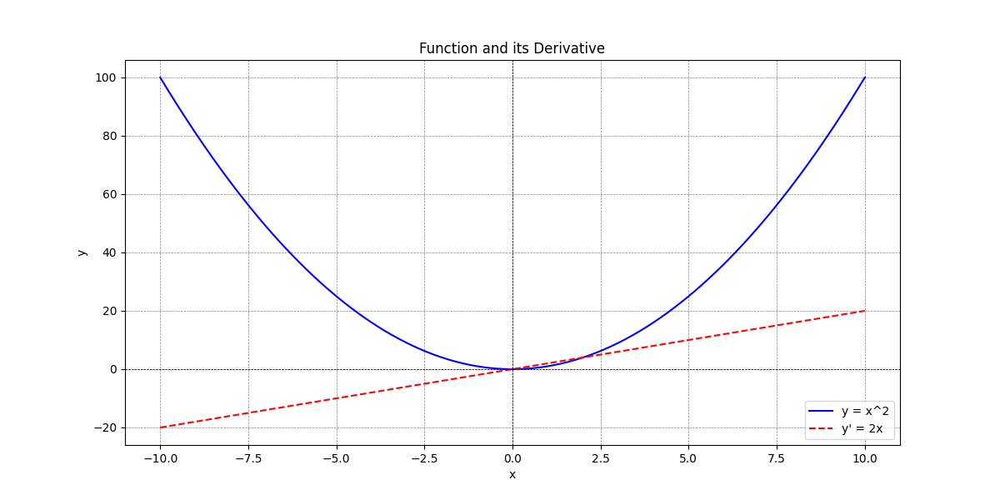
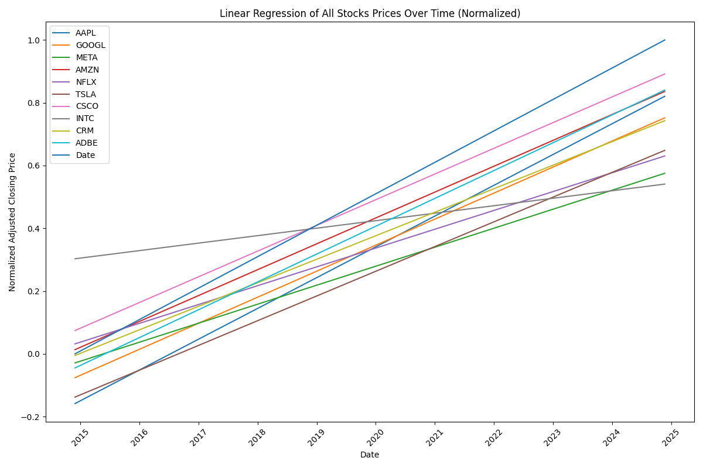
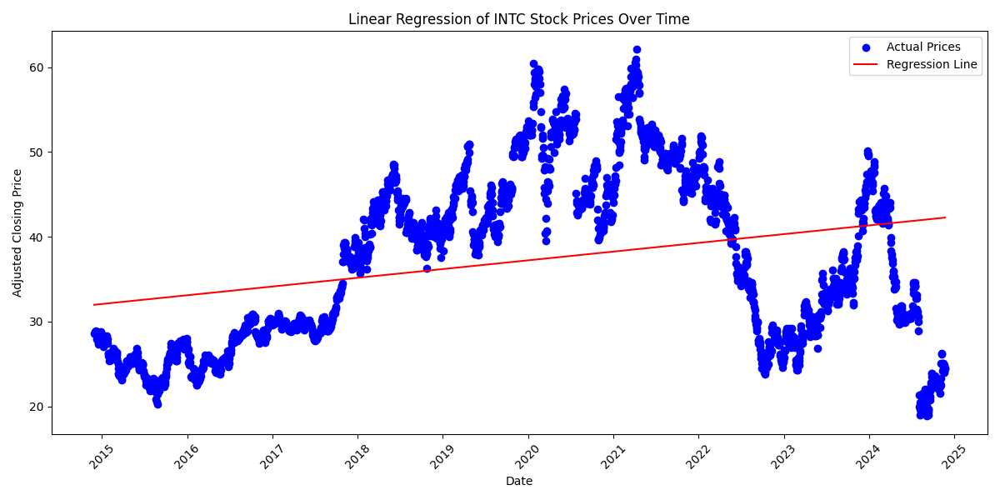
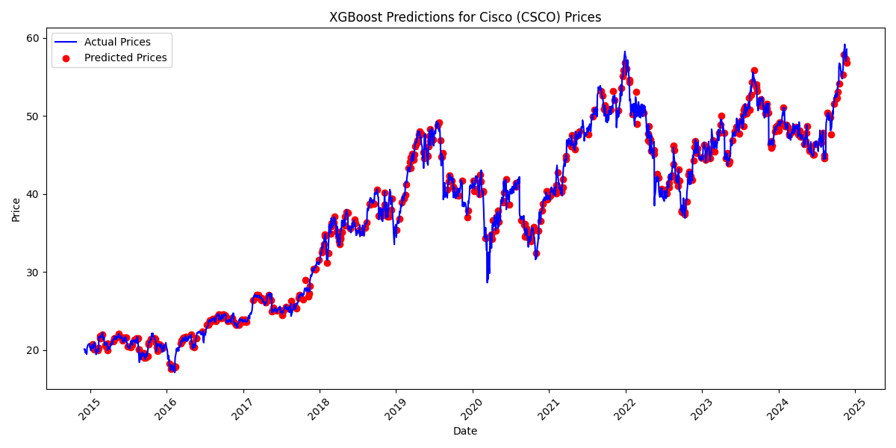

# 🎓 Alinda Documentation 🚀

## 📘 Introduction

Alinda is a powerful AI model designed to handle queries related to various academic and technical subjects. 💡 Whether you're exploring advanced data analytics, coding, or solving complex math problems, Alinda has you covered! She can create charts 📊, run code 💻, and even analyze stocks 📈. In essence, she's your personal data scientist and expert math professor rolled into one! 🎓

This documentation will guide you on how to set up and use the Alinda API, along with examples of how to make queries and handle responses.


---

## 🎯 What She is Designed For

Alinda is ideal for **University Students** & **Professionals** learning **Math** and **Computer Science**. 📚🔍 She excels at these fields and can help you with much more. Here are a few tasks Alinda can tackle:

- **Data Science Projects** for CS students 🧑‍💻
- **Math Visualizations** for complex equations 📐
- **Stock Analysis & Predictions** 💹

Below are some cool examples of what Alinda can do!

---

## 🖼 Some Visual Outputs:

Here’s a look at some of the awesome visualizations Alinda can create for you:

1. **Math Visual Learning**:  
   

2. **Stock Market Regression (Top 10 Stocks)**:  
   

3. **Linear Regression on Intel Stock**:  
   

4. **XGBoost Model for Cisco Stock**:  
   

---

## ⚙️ Setup

### 🛠️ Dependencies

Make sure you have the following dependencies installed:

- `fastapi` 🔥
- `pydantic` 📦
- `uvicorn` 🚀

Install them with pip:

```bash
pip install fastapi pydantic uvicorn
```

*(More dependencies coming soon!)*

### 📥 Importing Modules

Import the necessary modules and classes:

```python
from alinda_agent import LoadProfile
from fastapi import FastAPI
from pydantic import BaseModel
from typing import List
import os
import sys
import argparse
import uvicorn
from fastapi.responses import StreamingResponse
```

### 🚀 FastAPI Configuration

Initialize the FastAPI application:

```python
app = FastAPI()
```

---

## 🧠 Data Models

### 🔍 QueryRequest

The `QueryRequest` class defines the structure of the request payload for querying Alinda:

```python
class QueryRequest(BaseModel):
    query: str
    full_name: str
    major: str
    degree: str
    school: str
    year: str
    interests: List[str]
    wants_to_learn: List[str]
    previous_progress: dict
    messages: list
```

---

## 🔧 Endpoints

### 🌐 `/query/`

This endpoint handles standard queries to the Alinda AI model.

#### Request

- **Method**: `POST` ✍️
- **URL**: `/query/`
- **Headers**:
  - `Content-Type: application/json`
- **Body**:

```json
{
  "query": "What is the derivative of x^2?",
  "full_name": "Muneeb Ahmad",
  "major": "Computer Science",
  "degree": "Bachelor",
  "school": "Harvard University",
  "year": "2023",
  "interests": ["Machine Learning", "Deep Learning", "Computer Vision", "Mathematics", "Algorithms"],
  "wants_to_learn": ["Mathematics", "Computer Science", "Machine Learning", "Deep Learning", "Computer Vision", "Algorithms"],
  "previous_progress": {
    "differential_equations": "50%",
    "linear_algebra": "75%",
    "calculus": "100%",
    "probability_theory": "25%",
    "statistics": "50%",
    "machine_learning": "25%",
    "tensorflow": "50%",
    "streamlit": "25%"
  },
  "messages": [
    {
      "role": "assistant",
      "type": "message",
      "content": "The derivative of \\( x^2 \\) with respect to \\( x \\) can be calculated using the power rule..."
    }
  ]
}
```

#### Response

The response will be a JSON object containing Alinda’s answer to your query. 📬

---

### 📡 `/streaming-query/`

For real-time, streaming queries, use this endpoint to get continuous updates! 🌊

#### Request

- **Method**: `POST`
- **URL**: `/streaming-query/`
- **Headers**:
  - `Content-Type: application/json`
- **Body**: Similar to `/query/`, but allows for continuous feedback. ⚡

---

## 🧩 Example Usage

### 💬 Making a Query

Here's how to make a query to Alinda:

```python
profile_information =  {
    'major': 'Computer Science',
    'degree': 'Bachelor',
    'school': 'Harvard University',
    'year': '2023',
    'interests': ['Machine Learning', 'Deep Learning', 'Computer Vision', 'Mathematics', 'Algorithms'],
    'wants_to_learn': ['Mathematics', 'Computer Science', 'Machine Learning', 'Deep Learning', 'Computer Vision', 'Algorithms'],
    'previous_progress': {
        'differential_equations': '50%',
        'linear_algebra': '75%',
        'calculus': '100%',
        'probability_theory': '25%',
        'statistics': '50%',
        'machine_learning': '25%',
        'tensorflow': '50%',
        'streamlit': '25%',
    }
}

messages = [{'role': 'assistant', 'type': 'message', 'content': "The derivative of \\( x^2 \\) with respect to \\( x \\) can be calculated using the power rule of differentiation..."}]

query_request = QueryRequest(
    query='What is the derivative of x^2?',
    full_name='Muneeb Ahmad',
    major=profile_information['major'],
    degree=profile_information['degree'],
    school=profile_information['school'],
    year=profile_information['year'],
    interests=profile_information['interests'],
    wants_to_learn=profile_information['wants_to_learn'],
    previous_progress=profile_information['previous_progress'],
    messages=messages
)

response = query(query_request)
```

### 🔄 Second Query Example

```python
second_query = QueryRequest(
    query='What is the derivative of x^3?',
    full_name='Muneeb Ahmad',
    major=profile_information['major'],
    degree=profile_information['degree'],
    school=profile_information['school'],
    year=profile_information['year'],
    interests=profile_information['interests'],
    wants_to_learn=profile_information['wants_to_learn'],
    previous_progress=profile_information['previous_progress'],
    messages=response
)

response_v2 = query(second_query)

print(response_v2)
```

---

## 🖥️ Queries for Backend Developers

### 1. Create a Chart for NVIDIA and Apple Stocks 📉

```json
{
  "query": "Create a chart for NVIDIA and Apple stocks for the past 10 years.",
  "full_name": "Backend Developer",
  "major": "Computer Science",
  "degree": "Bachelor",
  "school": "Harvard University",
  "year": "2023",
  "interests": ["Data Visualization", "Stock Analysis"],
  "wants_to_learn": ["Data Visualization", "Stock Analysis"],
  "previous_progress": {
    "data_visualization": "75%",
    "stock_analysis": "50%"
  },
  "messages": []
}
```

### 2. Find the Derivative of x² and Plot It 🧮

```json
{
  "query": "Find the derivative of x**2 and plot it.",
  "full_name": "Backend Developer",
  "major": "Computer Science",
  "degree": "Bachelor",
  "school": "Harvard University",
  "year": "2023",
  "interests": ["Calculus", "Data Visualization"],
  "wants_to_learn": ["Calculus", "Data Visualization"],
  "previous_progress": {
    "calculus": "100%",
    "data_visualization": "75%"
  },
  "messages": []
}
```

---

## 🚀 Running the Application

To run the FastAPI application, use the following command:

```bash
uvicorn main:app --reload
```

This will start the server at `http://localhost:6969`. 🌍

---

### High-Level Usage (Alinda)

```python
from alinda_agent import LoadProfile

    profile_information =  {
        'major': 'Computer Science',
        'degree': 'Bachelor',
        'school': 'Harvard University',
        'year': '2023',
        'interests': ['Machine Learning', 'Algorithms'],
        'wants_to_learn': ['Mathematics', 'Computer Science', 'Machine Learning', 'Deep Learning', 'Computer Vision', 'Algorithms'],
        'previous_progress': {
            'differential_equations': '50%',
            'linear_algebra': '75%',
            'calculus': '100%',
            'probability_theory': '25%',
            'statistics': '50%',
            'machine_learning': '25%',
        }
    }
    
    
    profile = LoadProfile('Muneeb Ahmad', preferences=profile_information)
    profile.load_llm_configurations()
    profile.run_query('What is the derivative of x^2?')

```

### High-Level Usage (Personalization Endpoint)

```python

from alinda_agent import BuildPersonalizedProfile

personlize_agent = BuildPersonalizedProfile(query_request.model_dump(), messages=query_request.messages)
output = personlize_agent.build_profile()

```

## Voice Integration (Deepgram)

AlindaAI has now been integrated to use Deepgrams TTS Models for <0.5 second audio generations. It also features a Voice Agent Mode that ensures all text generated sounds natural.

## Security & Sandboxing

Below are some of the services we can integrate in the next release for true sandboxing & running the code.

- https://github.com/vndee/llm-sandbox (Brand New Project)
- https://github.com/tjmlabs/AgentRun (Old Project - No LTS)
- E2B Integration (Up & Running)
- Deploy AlindaAI Session inside Docker Instance Itself (Simple & Effective)

Currently AlindaAI Features Integration with `guardrails` to ensure no offensive or malicious code is executed.


## Built By

Muneeb Ahmad (C) Eve Works 2024 - muneeb@muneeb.co

## 🎉 Conclusion

That’s it! 🎉 This documentation will help you get started with using the Alinda API. If you need more details, check out the source code and further documentation for all the advanced features. Happy coding! 🚀💻

---

